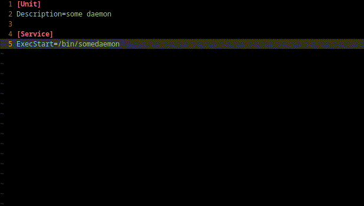

# systemd-language-server

[](https://pypi.org/project/systemd-language-server)
[](https://github.com/psacawa/systemd-language-server/actions)
[](https://github.com/psacawa/systemd-language-server/blob/master/LICENSE)

Language server for systemd unit files. Result of an exercise to learn the language server protocol.

## Supported Features

### `textDocument/completion`

Completion for

- unit file directives
- unit file sections
<!-- - values of some directives -->


### `textDocument/hover`

Documentation for directives supplied on hovering.



For markup in hover windows (i.e. the fancy highlighting), `pandoc` must be found in `$PATH`. Otherwise, there will be fallback to plain text.

## Installation

```
pip install systemd-language-server
```

## Integrations

### coc.nvim

In `coc-settings.json`, under `.languageserver`:

```json
...
"systemd-language-server": {
  "command": "systemd-language-server",
  "filetypes": ["systemd"]
}
...
```
